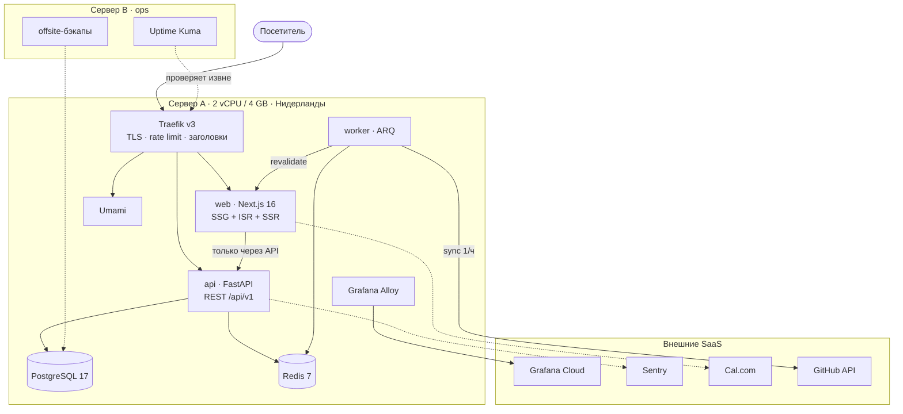

<div align="center">

# sorxill.ru

**Персональный сайт-визитка Python backend инженера.**
Next.js 16 · FastAPI · Docker · выделенный VPS в Нидерландах

[](https://github.com/sorxill/sorxill.ru/actions/workflows/pipeline.yml)
[](#тесты)
[](apps/api/pyproject.toml)
[](apps/web/tsconfig.json)
[](LICENSE)

[Сайт](https://sorxill.ru) · [HLD](docs/01-HLD.md) · [LLD](docs/02-LLD.md) · [Макет](docs/03-homepage-mockup.html) · [ADR](docs/adr/)

</div>

---

## Что это

Не шаблон с маркетплейса. Сайт спроектирован как продакшен-сервис: слоистый бэкенд с
проверяемыми границами слоёв, гибридный рендеринг, наблюдаемость снаружи сервера,
деплой с health-gate и автооткатом. Вся документация — в репозитории, включая реестр
архитектурных решений с честно выписанными минусами каждого.

**Дизайн-подпись:** карьера отрисована как waterfall распределённой трассировки —
длина полосы равна длительности работы, насечки внутри полосы это релизы и измеренные
дельты (`5 мин → 1 мин`, `1.4 ГБ → 0.3 ГБ`). Структура несёт данные, а не украшает.

## Архитектура



Почему не Kubernetes, не микросервисы и не self-hosted PaaS — в [реестре решений](docs/01-HLD.md#12-реестр-решений-adr),
15 ADR с альтернативами. Почему настоящий HA на одном сервере невозможен и что дано
вместо него — [HLD §3](docs/01-HLD.md).

## Стек

| Слой | Технологии | Решение |
|---|---|---|
| Фронтенд | Next.js 16 · React 19 · TypeScript strict · Tailwind v4 · next-intl | [ADR-001](docs/01-HLD.md) |
| Бэкенд | Python 3.12 · FastAPI · Pydantic v2 · SQLAlchemy 2 async · Alembic | [ADR-002](docs/01-HLD.md) |
| Данные | PostgreSQL 17 · Redis 7 · ARQ | [ADR-009](docs/01-HLD.md) |
| Инфраструктура | Docker · Compose · Traefik v3 · Let's Encrypt | [ADR-003](docs/01-HLD.md) |
| Наблюдаемость | OpenTelemetry · Grafana Alloy → Grafana Cloud · Sentry · Umami | [ADR-010](docs/01-HLD.md) |
| Качество | pytest · vitest · Playwright · ruff · mypy strict · import-linter · Trivy | [LLD §6](docs/02-LLD.md) |

## Быстрый старт

```bash
cp .env.example .env      # заполнить пароли
make dev                  # web → localhost:3000/ru · api → localhost:8000/docs
make test
make lint                 # ровно то, что проверит CI
```

Первый деплой на чистый сервер — [runbook](docs/runbooks/first-deploy.md).

## Тесты

```
27 passed · coverage 94% · порог 85%, понижать нельзя
```

| Уровень | Что проверяет |
|---|---|
| unit | инварианты сущностей и value objects, без БД и моков |
| unit | use cases на in-memory фейках портов |
| **contract** | каждая реализация порта против общего набора — новая обязана пройти тот же |
| api | все эндпоинты через ASGI-транспорт, включая 401/403/422 |
| **import-linter** | границы слоёв: домен не может импортировать FastAPI или SQLAlchemy |

## Архитектурные правила

Проект персональный: ревьюера нет, поэтому гейтом служит CI. Правила 1-6 проверяются
автоматически и ломают сборку, 7-9 — на моей совести.

1. `web` никогда не обращается к Postgres напрямую. Единственный путь к данным — через `api`.
2. Домен не импортирует FastAPI, SQLAlchemy и Pydantic. Проверяется `lint-imports` в CI.
3. Инварианты живут в сущностях, а не в роутерах. Роутер не должен иметь возможности их обойти.
4. Новая реализация порта обязана пройти контрактные тесты этого порта.
5. Образы не собираются на сервере. Только в CI: на 2 ядрах сборка положит сайт.
6. Каждый контейнер имеет явный лимит памяти.
7. Миграции обратно совместимы: expand → migrate → contract.
8. Компоненты авторятся mobile-first. «Адаптируем потом» = переписываем потом.
9. Неочевидное решение фиксируется ADR в [`docs/adr/`](docs/adr/).

## Что делает GitHub за меня

| Возможность | Зачем здесь |
|---|---|
| Environment `production` | Единственный источник правды по секретам, `.env` на сервере — производная ([ADR-0016](docs/adr/0016-upravlenie-sekretami.md)) |
| Deployments | История деплоев со ссылкой на живой сайт прямо в сайдбаре репозитория |
| Secret scanning + push protection | Блокирует пуш с секретом **до** попадания в историю |
| CodeQL | Еженедельный статический анализ безопасности, находки в Security |
| Dependabot | Патчи одним PR, мажоры по отдельности ([runbook](docs/runbooks/dependencies.md)) |
| GHCR | Реестр образов рядом с кодом, без внешнего сервиса |
| release-please | CHANGELOG и релизы собираются из conventional commits |
| Job summary | Покрытие и результат деплоя видны в сводке запуска, без чтения логов |

## План

- [x] **M0** — walking skeleton: слои, тесты, CI/CD, деплой по HTTPS
- [ ] **M1** — Postgres, Alembic, SQLAlchemy-репозитории под контрактные тесты
- [ ] **M2** — публичный сайт из макета, mobile-first, i18n, a11y-аудит
- [ ] **M3** — форма обратной связи, резюме, бронирование звонка
- [ ] **M4** — админка, RBAC, TOTP, лента GitHub, audit log
- [ ] **M5** — observability, бэкапы с проверенным restore, hardening

## Лицензия

Код — [MIT](LICENSE). Текст, резюме и элементы бренда — © 2026 Ярослав Бритов.
