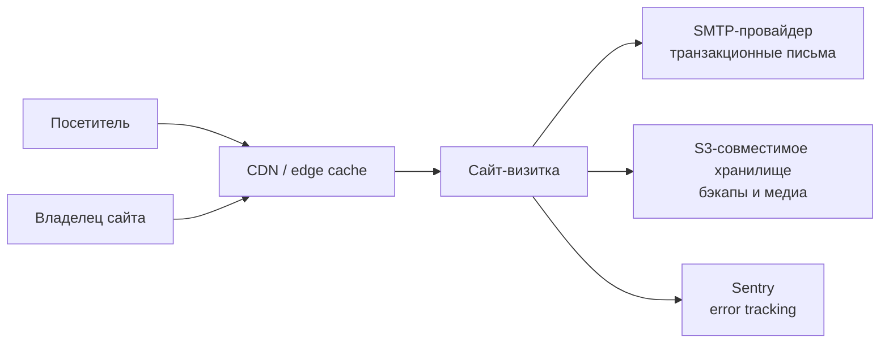
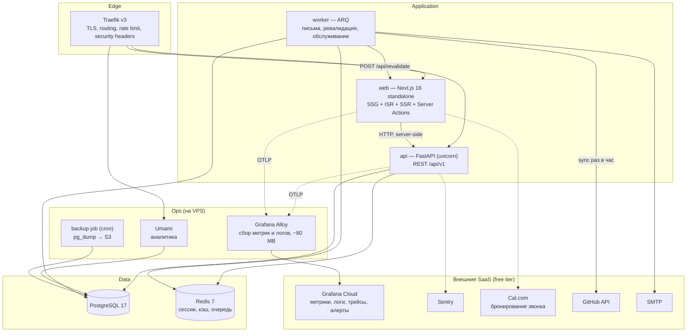
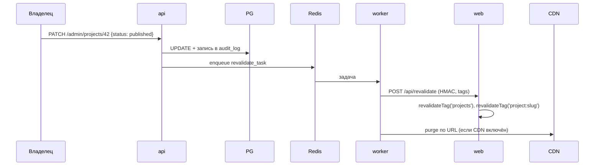

# HLD — Персональный сайт-визитка

**Версия:** 1.2 · **Дата:** 2026-07-29 · **Статус:** топология из двух серверов, ресурсный план пересчитан

---

## 0. Вводные данные (подтверждено)

| # | Параметр | Значение | Архитектурное следствие |
|---|---|---|---|
| C1 | **Сервер A (prod)** | Debian 12, 2 vCPU / 4 GB / 60 GB NVMe, NL — выделен только под сайт | Бюджет §11 умещается с запасом ~1.1 GB на rolling deploy |
| C2 | **Сервер B (существующий)** | Тот же класс, NL; на нём постоянно работает VPN владельца | Несёт VPN + staging (доступ только через VPN) + внешний uptime-мониторинг + вторичную копию бэкапов |
| C3 | Домен | `sorxill.ru`, регистратор reg.ru | Поддомены доступны бесплатно и без ограничений: при NS `ns1.reg.ru`/`ns2.reg.ru` A-записи добавляются в личном кабинете, изменения — до 24 ч |
| C4 | Локация | Нидерланды (не РФ) | Docker Hub доступен напрямую, зеркала реестров не нужны. Применяется GDPR, см. §8.1 |
| C5 | Языки | ru + en, переключатель на сайте | `next-intl`, префикс локали в URL, `hreflang`, две версии резюме |
| C6 | Трафик | Низкий, лимиты из §2 оставляем с запасом | Одна реплика `web` вместо двух |
| C7 | Контент | Через свою админку | Модуль контента + интеграции, см. §16 |
| C8 | Email | Внешний SMTP-провайдер | Свой SMTP не поднимаем |
| C9 | Профиль владельца | Software Engineer, Python Backend | Определяет содержание и визуальное направление |

> **Изменения против v1.0:** ресурсы каждой машины втрое меньше исходного расчёта, но машин две. Observability вынесена в облако (§10), сборка образов — только в CI (§9), добавлен swap (§11). Появление сервера B вернуло полноценный staging и внешний мониторинг — см. ADR-013.

### 0.1 Топология

| | Сервер A — prod | Сервер B — служебный |
|---|---|---|
| Публичный доступ | `sorxill.ru`, `admin.sorxill.ru` (443/80) | Нет. Только SSH и VPN-порт |
| Нагрузка | traefik, web, api, worker, postgres, redis, umami, alloy | VPN, staging-стек, Uptime Kuma, вторичная копия бэкапов |
| Кто ходит | Весь интернет | Только владелец через VPN |
| Если умрёт | Сайт недоступен (кэш CDN продолжает отдавать статику) | Сайт работает; теряются staging и мониторинг |

Два следствия, которые стоят отдельного упоминания:

1. **Staging не выставлен в интернет вообще.** Он слушает только на VPN-интерфейсе сервера B. Ни паролей, ни IP-allowlist, ни `noindex` не нужно — снаружи его просто нет. Это лучше любого варианта с basic-auth на публичном поддомене.
2. **Мониторинг наконец внешний.** Uptime Kuma на сервере B проверяет prod с другой машины — то, чего принципиально нельзя было сделать на одном сервере. Плюс алерт «сервер A недоступен целиком» теперь физически возможен.

---

## 1. Цели и не-цели

**Цели (по приоритету):**

1. Быстрый, доступный (a11y) сайт с уникальным дизайном; p75 LCP < 1.8 с на 4G.
2. Чистая расширяемая кодовая база: добавление новой сущности («услуги», «блог») не требует правок в существующих модулях.
3. Воспроизводимый деплой: `git push` → прод, откат одной командой.
4. Наблюдаемость: любой инцидент диагностируется без SSH на сервер.
5. Тесты как страховка рефакторинга, а не как метрика покрытия.

**Не-цели (осознанно отказываемся):**

- Kubernetes, service mesh, микросервисы. Один VPS, один домен, один разработчик — k8s здесь добавляет 3 слоя абстракции и ни одной решённой задачи.
- Брокеры сообщений (Kafka/RabbitMQ). Redis + ARQ покрывают всю асинхронщину.
- Мультитенантность, биллинг, соцсеть-функции.
- Собственная система аналитики. Берём готовую.

---

## 2. Качественные атрибуты и SLO

| Атрибут | Цель | Как измеряем |
|---|---|---|
| Доступность | 99.5% / мес (≈3.6 ч простоя) | Uptime Kuma / внешний чекер, 1 мин интервал |
| Latency API | p95 < 150 мс, p99 < 400 мс | Prometheus histogram по маршрутам |
| Web Vitals | LCP < 1.8 с, INP < 200 мс, CLS < 0.1 (p75) | Lighthouse CI в PR + RUM из аналитики |
| RPO | ≤ 24 ч (ночной дамп) | Проверка восстановления раз в месяц |
| RTO | ≤ 30 мин | Прогон runbook на чистой машине |
| Ошибки | 5xx < 0.5% запросов | Sentry + Prometheus alert |
| Bundle | все клиентские чанки ≤ 260 KB brotli | `size-limit` в CI; per-route бюджет — Lighthouse CI в M2 ([ADR-0017](adr/0017-byudzhet-bandla.md)) |

---

## 3. Честно про отказоустойчивость

Один сервер — одна точка отказа. То, что мы реально можем дать, и чего не можем:

**Даём:**
- Zero-downtime деплой (rolling replace за reverse-proxy, health-gated).
- Автоперезапуск упавших контейнеров (`restart: unless-stopped` + healthcheck).
- **Graceful degradation:** статические страницы (SSG) продолжают отдаваться, даже если FastAPI и Postgres мертвы. Ломается только форма обратной связи и админка. Это ключевое архитектурное решение — публичный сайт не зависит от бэкенда в runtime.
- Бэкапы с проверенным восстановлением.

**Не даём без второго узла или CDN:**
- Устойчивость к падению самого VPS / сети провайдера.

### 3.1 Что даёт сервер B помимо staging

Вторая машина — не «запасная», а носитель трёх свойств, которых нельзя получить на одном сервере ни за какие деньги:

1. **Внешний мониторинг.** Uptime Kuma на сервере B проверяет сервер A. Мониторить машину с самой этой машины бессмысленно: когда она умрёт, умрёт и алерт.
2. **Offsite-бэкапы.** Основная копия — в S3, вторичная — на сервере B. Правило 3-2-1 наконец выполняется, а не декларируется.
3. **Warm standby (опционально, M5+).** На B лежит тот же образ `web` со сборкой статики и `CONTACT_PERSIST=false`. При падении A переключаем DNS (TTL 300 с) и получаем работающий, но урезанный сайт: страницы отдаются, форма пересылает письмо, админка недоступна. RTO ~10 минут вручную, ~2 минуты скриптом.

Полноценного HA это не даёт и не должно: синхронная репликация Postgres между двумя 4-гигабайтными машинами создаст больше проблем, чем решит. Стратегия «статика выживает, динамика деградирует» честнее и дешевле.

**Рекомендуемый апгрейд (ADR-008):** CDN перед origin. Тогда закэшированная статика отдаётся при мёртвом origin, а нагрузка на VPS падает на порядок. Выбор провайдера зависит от аудитории: для ЕС/США — Cloudflare, для РФ-аудитории при РФ-локации сервера — Yandex CDN или Selectel CDN (Cloudflare даёт непредсказуемую задержку и капчи для части РФ-пользователей).

---

## 4. Контекст (C4 level 1)



---

## 5. Контейнеры (C4 level 2)



**Почему observability уехала наружу:** Prometheus + Loki + Grafana съедали ~1.6 GB — почти половину доступной памяти, при этом это единственный компонент, чей простой не влияет на пользователя. На VPS остаётся только агент-сборщик (Grafana Alloy, ~80 MB). Бонус: если сервер умрёт, метрики и логи предынцидентного периода останутся снаружи — именно тогда они и нужны.

**Разделение ответственности:**

| Контейнер | Отвечает за | Не отвечает за |
|---|---|---|
| `traefik` | TLS (ACME), маршрутизация по хостам, глобальный rate limit, security headers, доступ к ops-панелям | Бизнес-логику, аутентификацию пользователей |
| `web` | Рендеринг, i18n, SEO, анимации, Server Actions как тонкий прокси к API | Прямой доступ к БД (запрещён архитектурно) |
| `api` | Вся бизнес-логика, валидация, авторизация, работа с БД | Рендеринг HTML |
| `worker` | Всё, что может быть медленным или требует ретраев | Синхронные запросы от пользователя |
| `postgres` | Единственный источник правды | — |
| `redis` | Сессии, кэш, очередь ARQ, счётчики rate limit | Долговременное хранение |

Ключевое правило: **`web` никогда не обращается к Postgres напрямую.** Единственный путь к данным — через `api`. Это то, что делает фронт заменяемым и позволяет тестировать бэкенд изолированно.

---

## 6. Стратегия рендеринга

Это главное техническое решение проекта. Каждый маршрут получает стратегию осознанно, а не «SSR потому что модно».

| Маршрут | Стратегия | Кэш | Инвалидация |
|---|---|---|---|
| `/`, `/about`, `/services` | SSG на билде | edge + `Cache-Control: s-maxage` | on-demand при публикации |
| `/projects` | ISR | tag `projects` | `revalidateTag('projects')` |
| `/projects/[slug]` | SSG через `generateStaticParams` + ISR fallback | tag `project:{slug}` | точечная по слагу |
| `/blog/*` | ISR, `revalidate: 3600` | tag `posts` | по расписанию + on-demand |
| `/contact` | SSG, форма через Server Action | — | — |
| `/admin/*` | SSR, `dynamic = 'force-dynamic'`, `noindex` | нет | — |
| `/api/revalidate` | Route Handler, защищён HMAC-подписью | — | — |

Поток публикации контента:



Почему через воркер, а не напрямую из API: публикация не должна падать из-за того, что `web` перезапускается. Задача с ретраями — правильный ответ.

---

## 7. Модель доступов

Три уровня, три разных механизма — не смешиваем.

**7.1 Публичный сайт** — анонимный доступ, никакой авторизации. Защита: rate limit на форму, Turnstile/hCaptcha, honeypot-поле.

**7.2 Админка** — сессии на стороне сервера.
- Argon2id для пароля, обязательный TOTP (второй фактор).
- Сессия: opaque-токен в Redis, cookie `httpOnly; Secure; SameSite=Lax`, TTL 8 ч, абсолютный лимит 7 дней.
- RBAC: `OWNER` / `EDITOR` / `VIEWER` (матрица прав — в LLD §5).
- Отдельный поддомен `admin.<domain>`, опциональный IP-allowlist на уровне Traefik.
- Каждое мутирующее действие → запись в `audit_log`.

**7.3 Служебные панели** (Grafana, Umami, Traefik dashboard) — не выставляем в интернет по возможности. Доступ через SSH-туннель либо, если нужен веб, — отдельный поддомен + basic-auth на Traefik + IP-allowlist. Причина: control plane и панели — это отдельная поверхность атаки, а не часть приложения.

**7.4 Машинный доступ** — HMAC-подпись с nonce и временным окном для `revalidate` и вебхуков. Никаких «секретных URL».

---

## 8. Безопасность

| Слой | Меры |
|---|---|
| Хост | SSH только по ключам, root-логин выключен, UFW: 22/80/443, fail2ban, unattended-upgrades, docker-сокет не пробрасывается в контейнеры |
| Транспорт | TLS 1.3, HSTS с preload, редирект 80→443, OCSP stapling |
| Заголовки | CSP с nonce (без `unsafe-inline`), `X-Content-Type-Options`, `Referrer-Policy: strict-origin-when-cross-origin`, `Permissions-Policy` |
| Приложение | Строгий CORS (allowlist из ENV), rate limit двухуровневый (Traefik + Redis в API), pydantic-валидация на входе, параметризованные запросы, лимит размера тела |
| Секреты | Только через ENV; в репозитории — `.env.example`; шифрование через SOPS+age если понадобится хранить в git; ротация раз в квартал |
| Контейнеры | non-root user, read-only rootfs где возможно, `no-new-privileges`, pinned digest базовых образов, Trivy в CI блокирует HIGH/CRITICAL |
| Данные | IP хранится только как соль+хэш, PII в логах маскируется, retention 90 дней на сообщения |

---

## 9. Деплой и CI/CD

**Решение:** Docker Compose + Traefik + деплой из GitHub Actions по SSH. Kamal 2 рассматривался как альтернатива (см. ADR-003).

Обоснование: для одного приложения на одном сервере self-hosted PaaS (Coolify/Dokploy) — это дополнительный control plane, который может упасть независимо от приложения и сам является поверхностью атаки. Compose + скрипт rollout даёт то же самое без лишнего слоя.

**Пайплайн:**

```
PR:      lint (ruff+mypy strict, eslint+tsc) → unit → integration (testcontainers)
         → build images → e2e (Playwright на поднятом compose) → Trivy → Lighthouse CI
         → size-limit gate
main:    build multi-arch → push GHCR → SSH deploy
         → alembic upgrade head (one-shot job, до старта новых app-контейнеров)
         → rolling replace web и api → smoke-тест → авто-rollback при провале health
nightly: verify-backup (restore в временный контейнер + count-проверки) → Trivy rescan
```

**Жёсткое правило под 2 ядра:** на серверах **никогда** не собираются образы. `docker build` и `next build` на двух ядрах займут минуты и съедят всю память — на A это уронит сайт, на B ваш VPN. Сборка только в GitHub Actions, на сервер приходит готовый образ.

Реестр: GHCR. Локация NL — Docker Hub доступен напрямую, зеркала не нужны (пункт про РФ из v1.0 снят, но остаётся в ADR как контекст, если сервер когда-нибудь переедет).

**Окружения:** `local` (compose + hot reload) → `staging` (сервер B, доступ только через VPN) → `prod` (сервер A).

Staging на сервере B — урезанный контур: web, api, postgres, redis, без umami и alloy (~1.4 GB рядом с VPN). Ветка `main` деплоится туда автоматически, прод — только по тегу `v*` или вручную. Именно на staging проверяются миграции на восстановленной копии ночного дампа: это единственное место, где ошибку в `alembic upgrade` можно поймать до того, как она встретит реальные данные.

---

## 10. Наблюдаемость

| Что | Инструмент | Зачем именно так |
|---|---|---|
| Метрики | `prometheus-fastapi-instrumentator` → **Grafana Alloy** → Grafana Cloud (free: 10k серий) | RED-метрики по маршрутам без Prometheus на сервере |
| Логи | `structlog` / `pino` (JSON в stdout) → Alloy → Grafana Cloud (free: 50 GB) | Поиск по `trace_id`, логи выживают падение сервера |
| Трейсы | OpenTelemetry → Alloy → Grafana Cloud (free: 50 GB) | Видно, где ушло время: Next → API → PG |
| Ошибки | Sentry Cloud (free tier) | Стектрейсы с source maps; self-hosted Sentry требует ~4 GB сам по себе |
| Аналитика | **Umami** (MIT, cookieless, ~350 MB RAM) | Без cookie-баннера, данные у нас. Скрипт проксируем через свой домен — иначе блокировщики съедят 30–40% данных |
| Uptime | **Uptime Kuma на сервере B** — проверяет prod с другой машины каждую минуту | Собственный мониторинг вместо внешнего SaaS стал возможен только благодаря второй машине |
| Дашборды | 4 штуки: Golden Signals, Web Vitals, Business (заявки/визиты), Infra | Больше — никто не смотрит |

**Алерты (в Telegram):** 5xx > 1% за 5 мин · p95 > 500 мс за 10 мин · диск > 80% · контейнер в restart-loop · сертификат истекает < 14 дней · бэкап не прошёл.

Аналитика cookieless и без сбора PII, поэтому баннер согласия юридически не требуется — но страницу «Приватность» с описанием, что собирается, делаем всё равно.

---

## 11. Sizing и бюджет ресурсов (сервер A, 2 vCPU / 4 GB, выделен под сайт)

| Сервис | RAM (limit) | CPU (limit) | Примечание |
|---|---|---|---|
| Система + Docker daemon | ~400 MB | 0.1 | VPN переехал на сервер B — конкуренции за CPU больше нет |
| traefik | 96 MB | 0.2 | |
| web (Next.js, 1 реплика) | 512 MB | 0.6 | `NODE_OPTIONS=--max-old-space-size=384` |
| api (uvicorn, 2 воркера) | 384 MB | 0.4 | |
| worker (ARQ) | 192 MB | 0.2 | |
| postgres 17 | 768 MB | 0.5 | `shared_buffers=192MB`, `work_mem=8MB`, `max_connections=40` |
| redis 7 | 128 MB | 0.1 | `maxmemory 96mb`, политика `allkeys-lru` |
| umami | 320 MB | 0.2 | |
| grafana alloy | 96 MB | 0.1 | |
| **Итого** | **≈ 2.9 GB** | — | Свободно ~1.1 GB |

**Обязательные меры под это железо:**

1. **Swap 2 GB** с `vm.swappiness=10` — страховка от OOM-killer, который иначе выберет жертвой Postgres.
2. **Все лимиты в compose прописаны явно** (`deploy.resources.limits`). Контейнер без лимита при утечке памяти забирает сервер целиком.
3. **Сборка образов только в CI** (см. §9). Это не оптимизация, а условие работоспособности.
4. **Rolling replace, а не `--scale 2`:** во время деплоя `web` поднимается вторая копия и на 10–20 секунд потребление растёт до ~3.7 GB. Именно поэтому swap обязателен. Альтернатива — короткий downtime в 2–3 секунды; выбор за вами, по умолчанию берём rolling + swap.
5. **Логи с ротацией:** `json-file`, `max-size=10m`, `max-file=3` на каждый сервис, иначе 60 GB диска уйдут в логи за пару месяцев.
6. **`docker image prune` по cron**, храним 3 последних тега вместо 5.
7. ~~CPU-приоритет VPN~~ — снято: VPN на отдельной машине. Но лимиты остаются: они защищают Postgres от утечки в `web`, а не только VPN.

**Когда апгрейд станет обязательным:** блог с полнотекстовым поиском по Postgres, self-hosted Cal.com, или трафик выше ~30 rps устойчиво. Порог — 4 vCPU / 8 GB (это ~€8–10/мес у европейских провайдеров). Пока не нужно: план выше рабочий, просто без запаса на эксперименты.

---

## 12. Реестр решений (ADR)

| ID | Решение | Альтернативы | Почему так |
|---|---|---|---|
| 001 | Next.js 16 `output: standalone`, гибрид SSG/ISR/SSR | Astro (быстрее для контента), SvelteKit | Выбор заказчика; App Router + RSC + Server Actions закрывают и статику, и админку одним фреймворком, экосистема максимальная |
| 002 | FastAPI + SQLAlchemy 2 async + Alembic | Litestar (DI из коробки), Django | Дефолт greenfield-Python 2026, Pydantic v2, огромный рынок найма; DI добираем через `dependency-injector` |
| 003 | Docker Compose + Traefik + rollout-скрипт | Kamal 2, Coolify, Dokploy, k3s | Нет отдельного control plane = нет независимой точки отказа и лишней поверхности атаки. Kamal — достойная альтернатива, но смешивать его прокси с Compose-стейтфулом хуже, чем один механизм |
| 004 | Модульный монолит бэкенда, слоистая архитектура | Микросервисы | Один разработчик, один домен. Микросервисы здесь — распределённая транзакция там, где хватало функции |
| 005 | Контент в Postgres + on-demand ревалидация | MDX в репозитории | Даёт админку без деплоя. Если это не нужно — MDX проще, и это честный откат |
| 006 | Сессии в Redis, не JWT в localStorage | JWT | Отзыв сессии работает мгновенно, XSS не крадёт токен (`httpOnly`) |
| 007 | Umami self-hosted, проксированный | GA4, Plausible CE, PostHog | Cookieless, MIT, лёгкий. GA4 = баннер + adblock. PostHog = 4–8 GB RAM ради функций, которые визитке не нужны |
| 008 | CDN перед origin (провайдер по аудитории) | Только origin | Единственный способ получить настоящую устойчивость к падению VPS |
| 009 | Никаких брокеров, кроме Redis+ARQ | Kafka, RabbitMQ | Три типа задач: письма, ревалидация, обслуживание. Хватит Redis |
| 010 | Телеметрия во внешний Grafana Cloud, на сервере только Alloy | Self-hosted Prometheus+Loki+Grafana | 1.6 GB из 4 GB — недопустимо. Плюс данные переживают падение сервера |
| 011 | Бронирование звонка — встроенный Cal.com Cloud (free) | Self-hosted Cal.com, своя реализация | Self-hosted Cal.com — это ещё один Next.js + своя БД, ~1 GB. Своя реализация = поддержка часовых поясов, ICS, напоминаний, отмен. Не стоит того для визитки |
| 012 | GitHub — по официальному API с кэшем в Postgres; LinkedIn — курируемые вручную ссылки | Скрейпинг LinkedIn, сторонние RSS-мосты | У LinkedIn нет публичного API для чтения своих постов; скрейпинг нарушает ToS и ломается непредсказуемо. Честнее — витрина с ручным курированием |
| 013 | **Пересмотрено (v1.2):** staging на отдельном сервере B, слушает только VPN-интерфейс | Эфемерный staging в CI (v1.1), полный staging на том же VPS (v1.0) | Появилась вторая машина. Staging вне интернета = нулевая публичная поверхность атаки и честная проверка миграций |
| 014 | Одна БД Postgres на приложение и Umami, разные схемы | Отдельные инстансы | Второй Postgres = ещё 300+ MB. Разделение по схемам с отдельными ролями достаточно |

---

## 13. Риски

| Риск | Вероятность | Влияние | Что делаем |
|---|---|---|---|
| Падение VPS | Средняя | Высокое | CDN с кэшем + документированный runbook переезда, образ сервера в IaC |
| Утечка секретов через git | Низкая | Критическое | gitleaks в pre-commit и CI, `.env` в `.gitignore` с первого коммита |
| OOM-killer прибивает Postgres | Средняя | Высокое | Явные лимиты памяти на все контейнеры, swap 2 GB, алерт на memory > 85%, сборка только в CI |
| Доступность `.ru`-домена для части зарубежной аудитории | Низкая | Среднее | Резервный домен в зоне `.dev`/`.com` с 301-редиректом на основной — стоит €10/год и снимает вопрос |
| Раздувание бандла от анимаций | Высокая | Среднее | `size-limit` gate в CI, Motion только в клиентских островах, `prefers-reduced-motion` |
| Спам в форме | Высокая | Низкое | Turnstile + honeypot + rate limit + модерация перед отправкой уведомления |
| Проект встанет на этапе «идеальной архитектуры» | **Высокая** | Высокое | Milestones с рабочим деплоем уже на M1, вертикальные срезы вместо горизонтальных слоёв |

---

## 14. Roadmap

| Milestone | Содержание | Критерий готовности |
|---|---|---|
| M0 | Скелет монорепо, compose для локалки, CI на lint+тесты, «Hello» задеплоен на прод по HTTPS | Домен открывается, пайплайн зелёный |
| M1 | Дизайн-система, макеты, tokens, 2 ключевых экрана в вёрстке | Макеты согласованы, Lighthouse ≥ 95 |
| M2 | Публичный сайт целиком на SSG, контент замокан | Все страницы, i18n, a11y-аудит пройден |
| M3 | Бэкенд: домен, API, миграции, форма обратной связи, тесты | Покрытие целей достигнуто, OpenAPI опубликован |
| M4 | Админка, RBAC, 2FA, ревалидация, audit log | E2E-сценарий «залогинился → опубликовал → страница обновилась» |
| M5 | Observability, бэкапы с проверенным restore, алерты, security-hardening | Прогон runbook восстановления с нуля за < 30 мин |

---

## 15. Карта сайта и целевое действие

Посетитель — это в первую очередь технический рекрутер, тимлид или потенциальный заказчик. Он приходит на 40–90 секунд и решает один вопрос: «стоит ли писать этому человеку». Всё на сайте служит этому решению.

**Целевое действие (по приоритету):** забронировать звонок → скачать резюме → написать через форму. Соответственно, CTA присутствует в трёх точках: hero, конец блока опыта, футер.

| Раздел | Содержание | Стратегия | Приоритет |
|---|---|---|---|
| Hero | Кто вы, чем занимаетесь, один CTA | SSG | M2 |
| Опыт | Резюме, разбитое на блоки, с анимацией по скроллу | SSG | M2 |
| Стек | Технологии с честной градацией уровня владения | SSG | M2 |
| Проекты | Кейсы: задача → решение → результат в цифрах | ISR | M3 |
| GitHub | Живые данные по репозиториям через API | ISR, sync раз в час | M4 |
| Заметки | Короткие технические записки, полностью ваши | ISR | M4 |
| LinkedIn | Курируемая витрина ссылок на посты | ISR | M4 |
| Резюме | Скачивание PDF ru/en | SSG + подсчёт скачиваний | M3 |
| Бронирование | Встроенный виджет Cal.com | SSG + iframe | M3 |
| Контакты | Форма + соцсети | SSG + Server Action | M3 |
| `/uses`, `/now` | Инструменты и чем занят сейчас — недорого, читают охотно | SSG | M5 |

**Что предлагаю добавить (дёшево и уместно именно для backend-инженера):**

- **Command palette (⌘K)** — навигация с клавиатуры. Для аудитории «инженеры» это узнаваемый жест, и одновременно честный плюс к доступности.
- **Публичная страница статуса** — аптайм и p95 собственного сайта, живыми данными. Витрина инженерной культуры вместо рассказа о ней.
- **`/resume.json`** в формате JSON Resume и **RSS** для заметок — источник правды для всех версий резюме.
- **Автогенерация OG-изображений** через `opengraph-image.tsx` — ссылки красиво выглядят в мессенджерах.
- **Дневник изменений сайта** из git-истории — показывает, что проект живой.

Против чего предостерегаю: счётчики «лет опыта» с анимацией цифр, «AI-помощник, который отвечает за меня», музыка при загрузке, курсор-кастом на всю страницу. Первое — шаблон, остальное раздражает целевую аудиторию.

---

## 16. Интеграции

| Источник | Механизм | Частота | Деградация при недоступности |
|---|---|---|---|
| GitHub | REST/GraphQL API с PAT (read-only, только public scope), нормализация в таблицу `feed_items` | cron раз в час | Отдаём последний успешный снапшот из БД, баннер не показываем |
| LinkedIn | **Нет API для чтения своих постов.** Ручное добавление ссылки в админке, метаданные подтягиваются по OG-тегам | вручную | — |
| Cal.com | Встроенный виджет + вебхук на подтверждение брони | по событию | Fallback: кнопка «написать на email» |
| SMTP | Отправка через воркер с ретраями | по событию | Заявка сохранена в БД, письмо уйдёт при восстановлении. Пользователь видит успех — это правильно, данные не потеряны |

Архитектурно все внешние источники — реализации одного порта `ContentSource`, а не отдельные ветки в коде. Добавление «выступлений», Habr или Telegram-канала в будущем = новый адаптер + миграция на новый `source_type`, без правок существующих модулей. Это и есть тот фундамент под расширение, о котором вы просили.

---

## 17. Правовой контур (не юридическая консультация)

Я не юрист, поэтому здесь только перечень того, на что стоит посмотреть, и техническая часть, которую мы закрываем архитектурно.

**GDPR** применим: сервер в ЕС, посетители из ЕС. Что делаем технически: аналитика cookieless и без PII (баннер согласия не требуется), в форме собираем минимум полей, IP только в виде хэша, retention 90 дней с автоудалением, страница «Приватность» с перечнем данных и обработчиков (SMTP, Cal.com, Sentry — это субпроцессоры), эндпоинт удаления данных по запросу.

**Момент, который стоит проверить отдельно:** домен в зоне `.ru` + форма и бронирование, через которые персональные данные граждан РФ попадают на сервер в Нидерландах. Требования 152-ФЗ к локализации баз персональных данных здесь потенциально применимы. Наименее рискованный технический вариант, если не хотите разбираться: **не хранить заявки в БД вообще** — форма только пересылает сообщение вам на email и ничего не сохраняет (в БД остаётся лишь обезличенный счётчик). Архитектурно это переключается флагом `CONTACT_PERSIST=false`, реализуем оба режима. По самому вопросу применимости — стоит спросить юриста, а не меня.

---

## 18. Остались открытыми

1. Резюме (ru + en) — нужно для контента и для дизайн-брифа.
2. Согласовать визуальное направление (см. отдельный документ с вариантами брендинга).
3. Тайм-зона и правила доступности для бронирования звонков.
4. Ссылки на GitHub, LinkedIn, Telegram и что из этого показывать публично.
5. Нужен ли резервный домен вне `.ru`.
