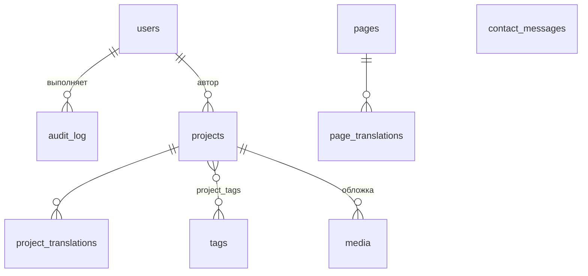

# LLD — Персональный сайт-визитка

**Версия:** 1.2 · Дополняет `01-HLD.md`

---

## 1. Структура репозитория

Монорепо на pnpm workspaces (фронт) + uv (бэкенд). Один репозиторий, потому что фронт и бэк деплоятся вместе и связаны контрактом.

```
site/
├─ apps/
│  ├─ web/                        # Next.js 16
│  └─ api/                        # FastAPI
├─ packages/
│  └─ api-types/                  # TS-типы, сгенерированные из OpenAPI
├─ infra/
│  ├─ compose/
│  │  ├─ docker-compose.yml            # база
│  │  ├─ docker-compose.local.yml      # hot reload, порты наружу
│  │  ├─ docker-compose.prod.yml       # реплики, лимиты, restart policy
│  │  └─ traefik/                      # dynamic conf, middlewares
│  ├─ grafana/                    # provisioning: datasources, 4 дашборда
│  ├─ scripts/
│  │  ├─ rollout.sh               # health-gated rolling replace
│  │  ├─ backup.sh / restore.sh
│  │  └─ bootstrap-vps.sh         # ufw, fail2ban, docker, юзер
│  └─ ansible/                    # опционально: idempotent-версия bootstrap
├─ docs/
│  ├─ 01-HLD.md  02-LLD.md
│  ├─ adr/                        # ADR-001.md ... по одному файлу
│  └─ runbooks/                   # restore.md, incident.md, rotate-secrets.md
├─ .github/workflows/             # ci.yml, cd.yml, nightly.yml
├─ Makefile                       # make dev / test / lint / deploy
└─ .env.example
```

**Правило:** каждое ADR — отдельный файл, дописывается по ходу проекта. Через полгода вы не вспомните, почему выбрали Redis-сессии, и перепишете на JWT.

---

## 2. Бэкенд: слоистая архитектура

```
apps/api/app/
├─ main.py                    # сборка приложения, lifespan, middleware
├─ container.py               # DI-контейнер, wiring
├─ core/
│  ├─ config.py               # pydantic-settings, единая точка чтения ENV
│  ├─ logging.py              # structlog, JSON, trace_id в контексте
│  ├─ errors.py               # иерархия исключений домена
│  └─ security.py             # argon2, TOTP, HMAC-подписи
├─ domain/                    # ← ноль внешних зависимостей, кроме stdlib
│  ├─ entities/               # Project, Page, ContactMessage, User
│  ├─ value_objects/          # Slug, Email, Locale, PublishStatus
│  ├─ services/              # доменные правила, не привязанные к сущности
│  └─ ports/                  # Protocol: ProjectRepository, Mailer, Clock, ...
├─ application/
│  ├─ use_cases/
│  │  ├─ projects/            # ListPublished, GetBySlug, Create, Update, Publish
│  │  ├─ contact/             # SubmitMessage
│  │  ├─ feed/                # ListFeed, SyncSource, CurateLink
│  │  ├─ resume/              # GetResumeFile, RegisterDownload
│  │  └─ auth/                # Login, VerifyTotp, Logout
│  └─ dto.py                  # входные/выходные DTO, без Pydantic-моделей API
├─ infrastructure/
│  ├─ db/                     # engine, session, ORM-модели, репозитории
│  ├─ cache/                  # Redis: сессии, счётчики, теги кэша
│  ├─ mail/                   # SMTP-адаптер + fake для тестов
│  ├─ sources/                # адаптеры порта ContentSource
│  │  ├─ github.py            # REST/GraphQL, ETag-кэш, обработка 403/rate-limit
│  │  ├─ curated.py           # ручные ссылки (LinkedIn и прочее) + разбор OG-тегов
│  │  └─ fake.py              # для тестов
│  ├─ storage/                # S3-совместимое (медиа, бэкапы, PDF резюме)
│  └─ telemetry/              # OTel-инициализация
├─ api/
│  ├─ v1/
│  │  ├─ routers/             # projects.py, pages.py, contact.py, auth.py, admin/
│  │  ├─ schemas/             # Pydantic-модели запросов/ответов
│  │  └─ deps.py              # get_current_user, require_role, rate_limit
│  ├─ error_handlers.py       # → RFC 9457 problem+json
│  └─ middleware.py           # request_id, timing, security
└─ workers/
   └─ tasks.py                # ARQ: send_email, revalidate, cleanup
```

**Направление зависимостей строго внутрь:** `api → application → domain`, `infrastructure → domain`. Домен не знает ни про SQLAlchemy, ни про FastAPI. Проверяется автоматически — `import-linter` в CI ломает сборку при нарушении.

### 2.1 SOLID — конкретно, а не декларативно

| Принцип | Как реализован |
|---|---|
| **S** | Один use case = один класс с методом `execute()`. `PublishProject` не умеет создавать проект |
| **O** | Новый способ доставки уведомлений = новый адаптер под `Mailer`; существующий код не меняется |
| **L** | Контрактные тесты на `ProjectRepository` запускаются против SQLAlchemy-реализации и in-memory fake — обе обязаны проходить один набор |
| **I** | Порты узкие: `Clock` — один метод `now()`. Не «UtilsService» на 20 методов |
| **D** | Use case принимает `ProjectRepository` (Protocol) в конструкторе; конкретный класс подставляет DI-контейнер |

Пример, задающий стиль на весь проект:

```python
# domain/ports/project_repository.py
class ProjectRepository(Protocol):
    async def get_by_slug(self, slug: Slug) -> Project | None: ...
    async def list_published(self, locale: Locale, limit: int, offset: int) -> list[Project]: ...
    async def save(self, project: Project) -> None: ...

# application/use_cases/projects/publish.py
class PublishProject:
    def __init__(self, repo: ProjectRepository, clock: Clock, tasks: TaskQueue) -> None:
        self._repo, self._clock, self._tasks = repo, clock, tasks

    async def execute(self, cmd: PublishProjectCommand) -> ProjectDTO:
        project = await self._repo.get_by_slug(cmd.slug)
        if project is None:
            raise NotFoundError(f"Проект {cmd.slug!r} не найден")
        project.publish(at=self._clock.now())          # инвариант — внутри сущности
        await self._repo.save(project)
        await self._tasks.enqueue("revalidate", tags=["projects", f"project:{project.slug}"])
        return ProjectDTO.from_entity(project)
```

Заметьте: правило «нельзя опубликовать проект без обложки» живёт в `Project.publish()`, а не в роутере. Роутер не сможет его обойти.

---

## 3. Модель данных



### DDL (ключевое)

```sql
CREATE TYPE publish_status AS ENUM ('draft', 'published', 'archived');
CREATE TYPE user_role      AS ENUM ('owner', 'editor', 'viewer');

CREATE TABLE users (
    id            uuid PRIMARY KEY DEFAULT gen_random_uuid(),
    email         citext NOT NULL UNIQUE,
    password_hash text   NOT NULL,
    role          user_role NOT NULL DEFAULT 'viewer',
    totp_secret   text,
    totp_enabled  boolean NOT NULL DEFAULT false,
    is_active     boolean NOT NULL DEFAULT true,
    failed_logins smallint NOT NULL DEFAULT 0,
    locked_until  timestamptz,
    created_at    timestamptz NOT NULL DEFAULT now()
);

CREATE TABLE projects (
    id           uuid PRIMARY KEY DEFAULT gen_random_uuid(),
    slug         text NOT NULL UNIQUE CHECK (slug ~ '^[a-z0-9]+(-[a-z0-9]+)*$'),
    status       publish_status NOT NULL DEFAULT 'draft',
    cover_id     uuid REFERENCES media(id) ON DELETE SET NULL,
    repo_url     text,
    live_url     text,
    stack        text[] NOT NULL DEFAULT '{}',
    sort_order   integer NOT NULL DEFAULT 0,
    published_at timestamptz,
    author_id    uuid REFERENCES users(id) ON DELETE SET NULL,
    created_at   timestamptz NOT NULL DEFAULT now(),
    updated_at   timestamptz NOT NULL DEFAULT now(),
    CONSTRAINT published_requires_date
        CHECK (status <> 'published' OR published_at IS NOT NULL),
    CONSTRAINT published_requires_cover
        CHECK (status <> 'published' OR cover_id IS NOT NULL)
);
CREATE INDEX projects_published_idx
    ON projects (status, sort_order DESC, published_at DESC)
    WHERE status = 'published';

CREATE TABLE project_translations (
    project_id uuid REFERENCES projects(id) ON DELETE CASCADE,
    locale     text NOT NULL CHECK (locale IN ('ru','en')),
    title      text NOT NULL,
    summary    text NOT NULL,
    body_md    text NOT NULL,
    PRIMARY KEY (project_id, locale)
);

CREATE TABLE contact_messages (
    id         uuid PRIMARY KEY DEFAULT gen_random_uuid(),
    name       text NOT NULL,
    email      citext NOT NULL,
    body       text NOT NULL CHECK (length(body) BETWEEN 10 AND 5000),
    ip_hash    text,                       -- sha256(ip + pepper), не сам IP
    user_agent text,
    is_spam    boolean NOT NULL DEFAULT false,
    handled_at timestamptz,
    created_at timestamptz NOT NULL DEFAULT now()
);
CREATE INDEX contact_created_idx ON contact_messages (created_at DESC);

-- Единая нормализованная лента из всех внешних источников.
-- Расширение на новый источник = новое значение enum + адаптер, без ALTER схемы.
CREATE TYPE feed_source AS ENUM ('github', 'curated_link', 'note');

CREATE TABLE feed_items (
    id           uuid PRIMARY KEY DEFAULT gen_random_uuid(),
    source       feed_source NOT NULL,
    external_id  text NOT NULL,           -- id репозитория / URL / slug заметки
    url          text NOT NULL,
    title        text NOT NULL,
    summary      text,
    locale       text CHECK (locale IN ('ru','en')),
    metrics      jsonb NOT NULL DEFAULT '{}',   -- stars, forks, language, reactions
    occurred_at  timestamptz NOT NULL,          -- дата события в источнике
    is_pinned    boolean NOT NULL DEFAULT false,
    is_hidden    boolean NOT NULL DEFAULT false,-- можно скрыть вручную из админки
    synced_at    timestamptz NOT NULL DEFAULT now(),
    UNIQUE (source, external_id)
);
CREATE INDEX feed_visible_idx ON feed_items (occurred_at DESC)
    WHERE is_hidden = false;

CREATE TABLE sync_runs (            -- наблюдаемость интеграций
    id         bigserial PRIMARY KEY,
    source     feed_source NOT NULL,
    status     text NOT NULL CHECK (status IN ('ok','partial','failed')),
    items_seen integer NOT NULL DEFAULT 0,
    error      text,
    started_at timestamptz NOT NULL,
    finished_at timestamptz
);

CREATE TABLE resume_downloads (     -- обезличенная метрика, без PII
    id          bigserial PRIMARY KEY,
    locale      text NOT NULL CHECK (locale IN ('ru','en')),
    referrer    text,
    created_at  timestamptz NOT NULL DEFAULT now()
);

CREATE TABLE audit_log (
    id         bigserial PRIMARY KEY,
    actor_id   uuid REFERENCES users(id) ON DELETE SET NULL,
    action     text NOT NULL,              -- 'project.published'
    entity     text NOT NULL,
    entity_id  text,
    payload    jsonb NOT NULL DEFAULT '{}',
    ip_hash    text,
    created_at timestamptz NOT NULL DEFAULT now()
);
```

**Флаг `CONTACT_PERSIST`** (см. HLD §17): при `false` use case `SubmitMessage` не пишет в `contact_messages`, а только ставит задачу на отправку письма и инкрементит обезличенный счётчик. Реализуется двумя адаптерами одного порта `ContactMessageSink` — `PostgresSink` и `NullSink`. Переключение = одна ENV-переменная, код use case не меняется. Это ровно та ситуация, для которой существует DIP.

**Решения, которые стоит зафиксировать:** инварианты дублируются в БД (`CHECK`) и в домене — БД защищает от ошибок миграций и ручных правок, домен даёт понятную ошибку пользователю. Переводы — отдельная таблица, а не `jsonb`, чтобы можно было индексировать и валидировать полноту. IP не хранится в открытом виде.

Миграции: Alembic, `autogenerate` только как черновик, каждая миграция читается глазами и имеет откат. Правило: миграции обратно совместимы (expand → migrate → contract), потому что при rolling deploy старая и новая версия кода живут одновременно.

---

## 4. API-контракт

Базовый префикс `/api/v1`. Ошибки — RFC 9457 `application/problem+json`.

### Публичные

| Метод | Путь | Ответ | Кэш |
|---|---|---|---|
| GET | `/projects?locale=ru&limit=20&cursor=` | `{items, next_cursor}` | `s-maxage=300` |
| GET | `/projects/{slug}?locale=ru` | `ProjectDetail` | `s-maxage=300` |
| GET | `/pages/{slug}?locale=ru` | `PageDetail` | `s-maxage=600` |
| GET | `/feed?source=github&limit=10` | `{items, next_cursor}` | `s-maxage=600` |
| GET | `/resume/{locale}` | `302` на подписанный URL в S3 (TTL 5 мин) + обезличенная метрика. **Без формы и без email** — гейт отсекает часть рекрутёров, а данных даёт мало | no-store |
| GET | `/resume.json` | JSON Resume | `s-maxage=3600` |
| GET | `/status` | `{uptime_pct_30d, p95_ms, last_deploy}` для публичной страницы статуса | `s-maxage=60` |
| POST | `/contact` | `202 {id}` | no-store |
| POST | `/webhooks/calcom` | `204`, проверка HMAC-подписи провайдера | no-store |
| GET | `/health` `/readyz` `/metrics` | — | no-store |

Пагинация — курсорная, не offset: offset ломается при вставке и медленно растёт.

### Админские (требуют сессию + роль)

```
POST   /auth/login            → 200 {mfa_required: true, challenge_id}
POST   /auth/mfa              → 204 + Set-Cookie (session)
POST   /auth/logout           → 204
GET    /auth/me               → UserProfile
GET    /admin/projects        → список включая черновики
POST   /admin/projects        → 201
PATCH  /admin/projects/{id}   → 200
POST   /admin/projects/{id}/publish   → 200, триггерит ревалидацию
DELETE /admin/projects/{id}   → 204 (soft delete → archived)
POST   /admin/media           → 201 (multipart, лимит 10 MB, whitelist MIME)
GET    /admin/feed            → лента включая скрытое
PATCH  /admin/feed/{id}       → pin / hide
POST   /admin/feed/links      → добавить курируемую ссылку (LinkedIn и прочее)
POST   /admin/sync/{source}   → принудительный синк, 202
GET    /admin/sync/runs       → история синков с ошибками
GET    /admin/messages        → список заявок
GET    /admin/audit           → журнал
```

### Формат ошибки

```json
{
  "type": "https://<domain>/errors/validation-failed",
  "title": "Validation failed",
  "status": 422,
  "detail": "Поле 'email' некорректно",
  "instance": "/api/v1/contact",
  "trace_id": "0af7651916cd43dd8448eb211c80319c",
  "errors": [{ "field": "email", "code": "invalid_format" }]
}
```

`trace_id` в каждой ошибке — это то, что превращает жалобу «у меня не отправилось» в одну строку поиска в Loki.

### RBAC-матрица

| Действие | owner | editor | viewer |
|---|---|---|---|
| Читать черновики | ✅ | ✅ | ✅ |
| Создавать/править контент | ✅ | ✅ | ❌ |
| Публиковать | ✅ | ✅ | ❌ |
| Удалять | ✅ | ❌ | ❌ |
| Читать заявки | ✅ | ✅ | ❌ |
| Управлять пользователями | ✅ | ❌ | ❌ |
| Читать audit log | ✅ | ❌ | ❌ |

Реализация: `Depends(require_role(Role.EDITOR))` — проверка на уровне зависимости роутера, не внутри хендлера. Забыть её нельзя: тест перебирает все админские маршруты и требует наличие guard'а.

---

## 5. Фронтенд

```
apps/web/src/
├─ app/
│  ├─ [locale]/
│  │  ├─ (marketing)/          # layout со SSG-настройками
│  │  │  ├─ page.tsx           # главная
│  │  │  ├─ about/ services/ contact/
│  │  │  └─ projects/[slug]/
│  │  └─ (admin)/admin/        # force-dynamic, noindex
│  ├─ api/revalidate/route.ts  # HMAC-проверка
│  ├─ sitemap.ts  robots.ts  opengraph-image.tsx
│  └─ globals.css              # @theme токены Tailwind v4
├─ features/                   # вертикальные срезы
│  ├─ projects/                # components/, hooks/, api.ts, types.ts
│  ├─ experience/              # блоки резюме + scroll-анимации
│  ├─ feed/                    # GitHub-лента, курируемые ссылки, заметки
│  ├─ resume/                  # выбор языка, кнопка скачивания, состояния
│  ├─ booking/                 # ленивый iframe Cal.com + скелетон
│  ├─ command-palette/         # ⌘K, регистрация команд из фич
│  ├─ contact/                 # form.tsx, action.ts, schema.ts
│  └─ admin-editor/
├─ shared/
│  ├─ ui/                      # Button, Field, Dialog — дизайн-система
│  ├─ lib/                     # api-client (типизирован из OpenAPI), cn, fetcher
│  └─ motion/                  # пресеты анимаций, useReducedMotion
└─ i18n/                       # next-intl: config, ru.json, en.json
```

Организация по фичам, а не по типам файлов. `components/`, `hooks/`, `utils/` на верхнем уровне превращаются в свалку на 200 файлов к третьему месяцу.

**Правила:**
- Server Components по умолчанию. `'use client'` — только там, где есть состояние, анимация или обработчики. Каждый такой файл — осознанное решение.
- Данные тянутся в Server Components через типизированный клиент; клиентские компоненты получают их пропсами. `useEffect` для загрузки данных не используем.
- Форма обратной связи — Server Action + `useActionState`, zod-схема **одна** и шарится между клиентской и серверной валидацией.
- Motion только в клиентских островах, импорт ленивый. Обязательный `useReducedMotion` — анимация выключается по системной настройке, иначе это баг доступности.
- Шрифты — `next/font/local`, самохост, `display: swap`, subset. Никаких запросов к Google Fonts (и лишний RTT, и вопросы GDPR).
- Изображения — `next/image` + `sharp` в образе, AVIF/WebP, обязательные `width/height` против CLS.
- **Сторонние виджеты (Cal.com) — только по клику или при попадании в viewport.** Iframe в разметке с первого рендера съедает ~300 KB и портит LCP на странице, где 90% посетителей на него не смотрят.
- Анимации блоков резюме — на `IntersectionObserver` + CSS-переходах по возможности; Motion берём там, где нужны orchestration и spring-физика. Никакой библиотеки скролл-джекинга: она ломает клавиатурную навигацию и поиск по странице.
- Бюджет анимации: не более одного «главного» эффекта на экран. Всё остальное — микровзаимодействия на 120–200 мс.

### Дизайн-токены (каркас, наполним на этапе дизайна)

Tailwind v4 через CSS-переменные в `@theme` — токены становятся единственным источником правды и для CSS, и для утилит:

```css
@theme {
  --color-surface: …;  --color-ink: …;  --color-accent: …;
  --font-display: …;   --font-body: …;  --font-mono: …;
  --text-step--1 … --text-step-5;        /* модульная шкала */
  --space-1 … --space-16;                 /* 4px база */
  --ease-out-expo: cubic-bezier(0.16, 1, 0.3, 1);
}
```

Хардкод цвета или размера в компоненте — повод отклонить PR. Конкретные значения появятся после согласования визуального направления.

---

## 6. Тестирование

Пирамида, а не «покрытие 100%».

### Бэкенд

| Уровень | Что покрываем | Инструменты | Цель |
|---|---|---|---|
| Unit | Домен: инварианты сущностей, value objects, доменные сервисы. Без БД, без моков | pytest | ≥ 95% на `domain/` |
| Unit | Use cases с in-memory фейками портов | pytest, polyfactory | ≥ 90% на `application/` |
| Contract | Каждая реализация порта против общего набора тестов | параметризованные фикстуры | 100% портов |
| Integration | Репозитории, миграции, транзакции — на реальном Postgres | testcontainers-python | ключевые пути |
| API | Роутеры через `httpx.AsyncClient` + ASGI transport | pytest-asyncio | все эндпоинты, включая 401/403/422 |
| Contract-fuzz | Соответствие реализации OpenAPI-схеме | schemathesis | весь `/api/v1` |
| Security | Каждый админский маршрут требует авторизацию | собственный тест-обход роутов | 100% |

Общая цель — 85% с исключением `infrastructure/telemetry` и сгенерированного кода. Порог в CI не понижается никогда: `--cov-fail-under` только вверх.

### Фронтенд

| Уровень | Что | Инструменты |
|---|---|---|
| Unit | Компоненты дизайн-системы, хуки, zod-схемы | Vitest + Testing Library |
| Integration | Фичи с замоканным API | Vitest + MSW |
| a11y | Все ключевые страницы | `vitest-axe` + `@axe-core/playwright` |
| Visual | Дизайн-система и 4 главные страницы | Playwright screenshots, threshold 0.2% |
| E2E | 5 сценариев (см. ниже) | Playwright, 3 браузера + мобильный viewport |
| Perf | Бюджеты | Lighthouse CI + `size-limit`, блокируют merge |

**E2E-сценарии (только критичные пути — e2e дорогие и хрупкие):**
1. Главная грузится, навигация работает, i18n переключается.
2. Отправка формы обратной связи → 202 → успешное состояние UI.
3. Rate limit: повторные отправки → корректная ошибка, а не 500.
4. Админ логинится с TOTP → правит проект → публикует → публичная страница обновилась.
5. Клавиатурная навигация по главной без потери фокуса.

Нагрузочный тест — k6 smoke (50 rps, 2 мин) на staging перед релизом. Не для «выдержим ли миллион», а чтобы поймать N+1 и утечки соединений.

---

## 7. CI/CD

### `ci.yml` (на каждый PR)

```yaml
jobs:
  lint:        # ruff format --check, ruff check, mypy --strict, import-linter,
               # eslint, tsc --noEmit, gitleaks
  test-api:    # pytest -m "not integration" → pytest -m integration (testcontainers)
               # → coverage gate
  test-web:    # vitest run --coverage → size-limit
  build:       # docker buildx bake, cache в GHA, → Trivy (fail на HIGH/CRITICAL)
  e2e:         # docker compose -f base -f local up --wait → playwright test
               # → lighthouse-ci assert
```

Все джобы параллельны, кроме `e2e` (зависит от `build`). Целевое время пайплайна — до 8 минут; иначе его начнут обходить.

### `cd.yml` (push в `main`)

```
1. build & push → ghcr.io/<owner>/site-web:<sha>, site-api:<sha>  (+ tag latest)
2. ssh → git-less деплой: обновляем только .env-теги образов и compose
3. one-shot: docker compose run --rm api alembic upgrade head
4. rollout.sh api  → поднять новый контейнер, дождаться /readyz, убить старый
5. rollout.sh web  → то же
6. smoke: curl -f https://<domain>/ и /api/v1/health, проверка заголовков
7. при провале любого шага → rollout.sh --rollback <предыдущий sha>
8. уведомление в Telegram: sha, автор, время, ссылка на дифф
```

Образы тегируются SHA коммита, а не `latest` — иначе откат невозможен. Держим 5 последних тегов на сервере.

### `nightly.yml`

`pg_dump | gzip | age -e` → S3 → **проверка восстановления в одноразовый контейнер** с count-проверками таблиц → отчёт в Telegram. Непроверенный бэкап бэкапом не является. Плюс Trivy rescan (новые CVE появляются в уже собранных образах) и Renovate PR'ы.

---

## 8. Конфигурация

Всё через ENV, читается один раз в `core/config.py` (`pydantic-settings`), падает на старте при отсутствии обязательного значения — быстрый отказ лучше загадочного 500 в три ночи.

| Переменная | Пример | Обязательна |
|---|---|---|
| `APP_ENV` | `production` | ✅ |
| `DATABASE_URL` | `postgresql+asyncpg://…` | ✅ |
| `REDIS_URL` | `redis://redis:6379/0` | ✅ |
| `SECRET_KEY` | 64 hex | ✅ |
| `REVALIDATE_SECRET` | HMAC-ключ, общий с web | ✅ |
| `IP_PEPPER` | соль для хэша IP | ✅ |
| `SMTP_*` | host/port/user/pass/from | ✅ |
| `CORS_ORIGINS` | `https://domain,https://www.domain` | ✅ |
| `S3_*` | endpoint/bucket/key/secret | ✅ |
| `CONTACT_PERSIST` | `false` — не хранить заявки в БД (см. HLD §17) | ✅ |
| `GITHUB_TOKEN` | PAT, read-only, только public scope | ⬜ |
| `GITHUB_USERNAME` | `sorxill` | ⬜ |
| `NEXT_PUBLIC_CALCOM_LINK` | ссылка на календарь | ⬜ |
| `CALCOM_WEBHOOK_SECRET` | — | ⬜ |
| `RESUME_S3_PREFIX` | `resume/` | ⬜ |
| `SENTRY_DSN`, `OTEL_EXPORTER_OTLP_ENDPOINT` | второй указывает на локальный Alloy | ⬜ |
| `TURNSTILE_SECRET` | — | ⬜ |
| `NEXT_PUBLIC_UMAMI_*` | website id, proxied url | ⬜ |
| `RATE_LIMIT_CONTACT` | `5/hour` | ⬜ |

---

## 9. Definition of Done (для каждой задачи)

- [ ] Тесты на новом коде написаны и проходят; покрытие не упало
- [ ] `mypy --strict` и `tsc --noEmit` чисто, `import-linter` не нарушен
- [ ] Ошибки обрабатываются и логируются с `trace_id`, пользователю показывается понятное сообщение
- [ ] Новые ENV добавлены в `.env.example` и в таблицу §8
- [ ] Клавиатурная доступность и `prefers-reduced-motion` проверены (для UI)
- [ ] Миграция обратно совместима и имеет `downgrade`
- [ ] Если решение неочевидно — добавлен ADR
- [ ] Бюджеты производительности не превышены
